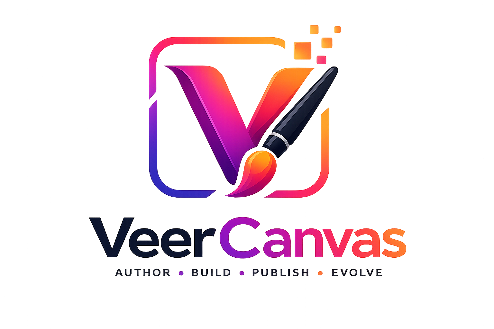

<p align="center">
  <picture>
    <source media="(prefers-color-scheme: dark)" srcset="assets/branding/veer-canvas-logo.svg">
    
  </picture>
</p>

# VeerCanvas

**VeerCanvas** is a content authoring and publishing platform for building rich web experiences — from static catalogs today to dynamic pages, server components, and APIs tomorrow.

The **VeerLabs Solutions** site (`sites/veerlabs/`) ships as the official reference implementation.

## Repository layout

```
├── admin/           # Flask CMS (authoring, publish, import)
├── cli/             # Import, catalog sync, publish tooling
├── core/            # Shared platform libraries (expanding)
├── deploy/          # Remote deploy, nginx, systemd helpers
├── docs/            # Platform documentation
└── sites/
    ├── canvas/      # Platform control plane (canvas.veerlabs.solutions)
    ├── ops/         # Ops console — observability + messagebox
    ├── veerlabs/    # Sample: VeerLabs project catalog
    └── _templates/  # Starter site scaffolds
```

## Quick start (VeerLabs sample site)

```bash
# Install admin dependencies
python3 -m venv .venv
source .venv/bin/activate
pip install -r admin/requirements.txt

# Run CMS locally against the VeerLabs site
export VEERCANVAS_SITE_ID=veerlabs
export VEERCANVAS_SITE_ROOT="$(pwd)/sites/veerlabs"
python admin/admin_app.py
# Admin: http://127.0.0.1:8080/

# Build public catalog (enabled projects only)
python cli/scripts/import_github_projects_full.py veeringman imported_projects \
  --site-root sites/veerlabs \
  --projects-json sites/veerlabs/projects.json \
  --write-public-catalog
```

## Create a new website

On the platform admin ([canvas.veerlabs.solutions/admin](https://canvas.veerlabs.solutions/admin/)), choose a **site id** (the author name). That becomes both the folder under `sites/` and the default public host:

`<site-id>.veerlabs.solutions` → content CMS at `https://<site-id>.veerlabs.solutions/admin/`

**Ops console:** [ops.veerlabs.solutions](https://ops.veerlabs.solutions/) — auth-gated only (redirects to `/admin`). Observability metrics and messagebox across managed sites.

Or via CLI:

```bash
python cli/scripts/create_site.py my-catalog \
  --name "My Catalog" \
  --domain my-catalog.veerlabs.solutions \
  --github-owner veeringman

# Content CMS for that site (not the platform):
export VEERCANVAS_SITE_ID=my-catalog
export VEERCANVAS_SITE_ROOT="$(pwd)/sites/my-catalog"
python admin/admin_app.py
```

Per-site admins manage **content only**. Website creation and production deploy live on the platform host.

In Admin, use **New project** to add a tile/slug/details without GitHub import. Use **Sync repos** to pull new private GitHub repos.

## Deploy

```bash
# Flagship catalog
SITE_ID=veerlabs EC2_KEY=/path/to/VeerSetuHost.pem ./deploy/remote-deploy.sh

# Platform control plane
SITE_ID=canvas EC2_KEY=/path/to/VeerSetuHost.pem ./deploy/remote-deploy.sh

# Ops console (observability + messagebox)
SITE_ID=ops EC2_KEY=/path/to/VeerSetuHost.pem ./deploy/remote-deploy.sh

# Any author-created site (example)
SITE_ID=my-catalog EC2_KEY=/path/to/VeerSetuHost.pem ./deploy/remote-deploy.sh

# Refresh GitHub repos during deploy (opt-in)
SITE_ID=veerlabs EC2_KEY=/path/to/VeerSetuHost.pem ./deploy/remote-deploy.sh --import-repos
```

Before first deploy of a new site, point DNS (`<site-id>.veerlabs.solutions`) at the EC2 host so TLS can be issued.

## Environment variables

| Variable | Default | Purpose |
|----------|---------|---------|
| `VEERCANVAS_ROOT` | repo root | Platform root path |
| `VEERCANVAS_SITE_ID` | `veerlabs` | Site folder under `sites/` |
| `VEERCANVAS_SITE_ROOT` | `sites/<id>` | Override site content root |
| `VEERCANVAS_ADMIN_SECRET` | dev default | Flask session secret |
| `VEERCANVAS_PLATFORM` | off | Enable website create/deploy APIs |
| `VEERCANVAS_OPS` | off | Enable observability + messagebox APIs |
| `VEERCANVAS_VISITOR_TOKEN_TTL` | `3600` | Visitor Learn More token lifetime (seconds) |
| `PORT` / `VEERCANVAS_ADMIN_PORT` | `8080` | Admin listen port |
| `IMPORT_REPOS` / `--import-repos` | off | Fetch GitHub repos on deploy |

## Docs

| Doc | Purpose |
|-----|---------|
| [docs/ARCHITECTURE.md](docs/ARCHITECTURE.md) | Surfaces, data model, auth, visits |
| [docs/ADMIN_MANUAL.md](docs/ADMIN_MANUAL.md) | CMS, Site Studio, Ops, Learn More |
| [docs/DEPLOY.md](docs/DEPLOY.md) | Remote deploy, nginx, preserve rules |
| [docs/CLI.md](docs/CLI.md) | create_site + GitHub import |
| [docs/API.md](docs/API.md) | Route catalog |
| [docs/HANDOFF.md](docs/HANDOFF.md) | Operator day-2 runbook |
| [docs/STATUS.md](docs/STATUS.md) | Shipped vs next tracker |
| [docs/ROADMAP.md](docs/ROADMAP.md) | Phased product roadmap |
| [CHANGELOG.md](CHANGELOG.md) | Release notes |
| [docs/MIGRATION.md](docs/MIGRATION.md) | Split from VeerSetu |

Also: [admin/README.md](admin/README.md) · [deploy/README.md](deploy/README.md) · [cli/README.md](cli/README.md)

## Roadmap

VeerCanvas is intentionally evolving beyond static publishing:

- **Now:** multi-site platform (canvas / ops / catalog CMS), templates, engagement, visitor tokens, visit metrics
- **Next:** richer dynamic routes, webhooks, draft/publish environments
- **Future:** component registry, edge rendering, managed hosting

See [docs/ROADMAP.md](docs/ROADMAP.md) and [docs/STATUS.md](docs/STATUS.md).

## Related projects

- **[VeerSetu](https://github.com/veeringman/veersetu)** — zero-trust edge fabric (separate product repo)
- **VeerLabs sample site** — `sites/veerlabs/` in this repository
