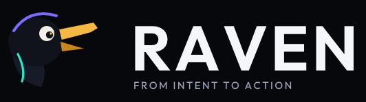

<p align="center">
  
</p>

<h3 align="center">The runtime for agentic applications.</h3>

<p align="center">
  <em>Today's applications wait for commands. RAVEN understands intent.</em>
</p>

RAVEN is a cross-platform agentic application runtime. Software built on it understands a goal, reasons over context, discovers capabilities, plans, acts under policy, verifies the outcome, and adapts.

Put this tree on your Mac as its own repository:

```bash
mkdir -p /Users/vijay/rnd/projects
cd /Users/vijay/rnd/projects
git clone --branch cursor/raven-foundation-6317 --single-branch \
  https://github.com/veeringman/veer-canvas.git veer-canvas-raven
mv veer-canvas-raven/raven raven
rm -rf veer-canvas-raven
cd raven
git init -b main
git add -A
git commit -m "Start the RAVEN runtime foundation and brand."
gh repo create veeringman/raven --public --source . --remote origin --push
```

`gh repo create` has to run on your Mac, signed in as `veeringman`. This agent login can push to `veer-canvas` and cannot create a new repository.

Intended GitHub remote:

```text
https://github.com/veeringman/raven
```

## Status

Foundational. The concept baseline is in [`docs/CONCEPT.md`](docs/CONCEPT.md). This tree implements the first runtime slice:

```text
Intent → Plan → Policy → Tool → Verify
```

Consequential and physical capabilities always stop and ask. The canonical demo never leaves the process.

## Run the demonstration

```bash
cargo run -p raven-cli -- demo
cargo run -p raven-cli -- principles
```

`raven demo` is "Prepare my day." Calendar, tasks, weather, and location are read and verified. Sending a message is risk L2, so the run stops in `WaitingForUser` and does not send anything.

## Layout

```text
raven/
├── assets/logo/          Lockup, app icon, favicon
├── assets/icons/         Loop and primitive icons
├── brand/                Identity page
├── crates/
│   ├── raven-core/       Goal, capability, risk, evidence
│   ├── raven-policy/     Allow, ask, or deny
│   ├── raven-tools/      Capability registry
│   ├── raven-execution/  Goal state machine
│   ├── raven-verification/
│   ├── raven-events/
│   ├── raven-runtime/    The loop
│   └── raven-cli/
├── docs/
└── examples/prepare-my-day/
```

## Documents

- [Concept baseline](docs/CONCEPT.md)
- [Architecture of this tree](docs/ARCHITECTURE.md)
- [Roadmap](docs/ROADMAP.md)
- [Brand](docs/BRAND.md)

## Principles

Intent over workflow. Policy before execution. Verification before completion. Human authority over autonomy. Local before cloud. Data is not an instruction. Capability is not permission.

## License

Apache-2.0. The wordmark is set in [Outfit](brand/fonts/OFL.txt), used under the SIL Open Font License.
