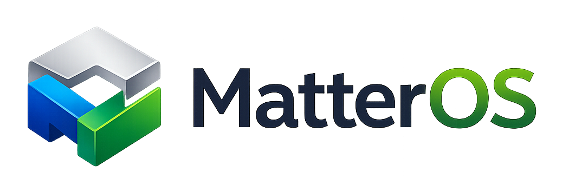

<div align="center">

<p align="center">
  
</p>

### The Intelligence Layer for the Physical World

*"MatterOS doesn't store models. It stores understanding."*

---

AI-native operating system for understanding, designing, simulating, manufacturing, operating, maintaining and evolving physical objects.

</div>

---

## Vision

Software has operating systems.

Robots have ROS.

Data has databases.

The physical world has CAD files, BOMs, PDFs, drawings and disconnected engineering systems.

MatterOS changes that.

MatterOS represents every physical object as a living semantic entity that AI can understand, reason about and continuously improve.

Instead of storing files, MatterOS stores knowledge.

---

## Why MatterOS?

Today's engineering ecosystem is fragmented.

- CAD stores geometry.
- PLM stores lifecycle data.
- ERP stores business information.
- MES stores manufacturing execution.
- Digital Twins monitor operation.

Each system understands only a small part of a product.

MatterOS introduces a unified knowledge model where every physical object has:

- Geometry
- Materials
- Functional intent
- Physical behavior
- Manufacturing knowledge
- Assembly logic
- Failure modes
- Cost
- Sustainability
- Maintenance
- Supply chain
- AI reasoning metadata

Everything becomes connected.

---

## Core Philosophy

MatterOS is **Purpose First**, not **Geometry First**.

Traditional CAD:

```
Cylinder
Bolt
Hole
Extrusion
```

MatterOS:

```
Fastener
Supports Load
Transfers Torque
Allows Serviceability
Manufacturable
Repairable
```

MatterOS understands *why* something exists.

---

## Core Principles

- AI Native
- Knowledge Graph First
- Physics Aware
- Manufacturing Aware
- Domain Agnostic
- Open Architecture
- Extensible
- Explainable
- Version Controlled
- Human + AI Collaboration

---

## Matter Entity

Everything is represented as a Matter Entity.

Examples:

- Material
- Fastener
- Bearing
- PCB
- IC
- Motor
- Sensor
- Pipe
- Beam
- Door
- Machine
- Robot
- Vehicle
- Building

Every entity contains both engineering knowledge and relationships.

---

## Architecture

MatterOS consists of several core platforms.

- Matter Core
- Matter Graph
- Matter AI
- Matter Studio
- Matter Vision
- Matter Sim
- Matter Factory
- Matter Twin
- Matter Cloud
- Matter SDK

---

## Long-term Goal

Become the universal semantic platform for the physical world.

The same way Linux became the operating system of servers and Android became the operating system of mobile devices, MatterOS aims to become the intelligence layer powering engineering and manufacturing.

---

## Status

MatterOS is currently in the architecture and research phase.

Contributions, ideas and discussions are welcome.

---

## License

Apache 2.0
