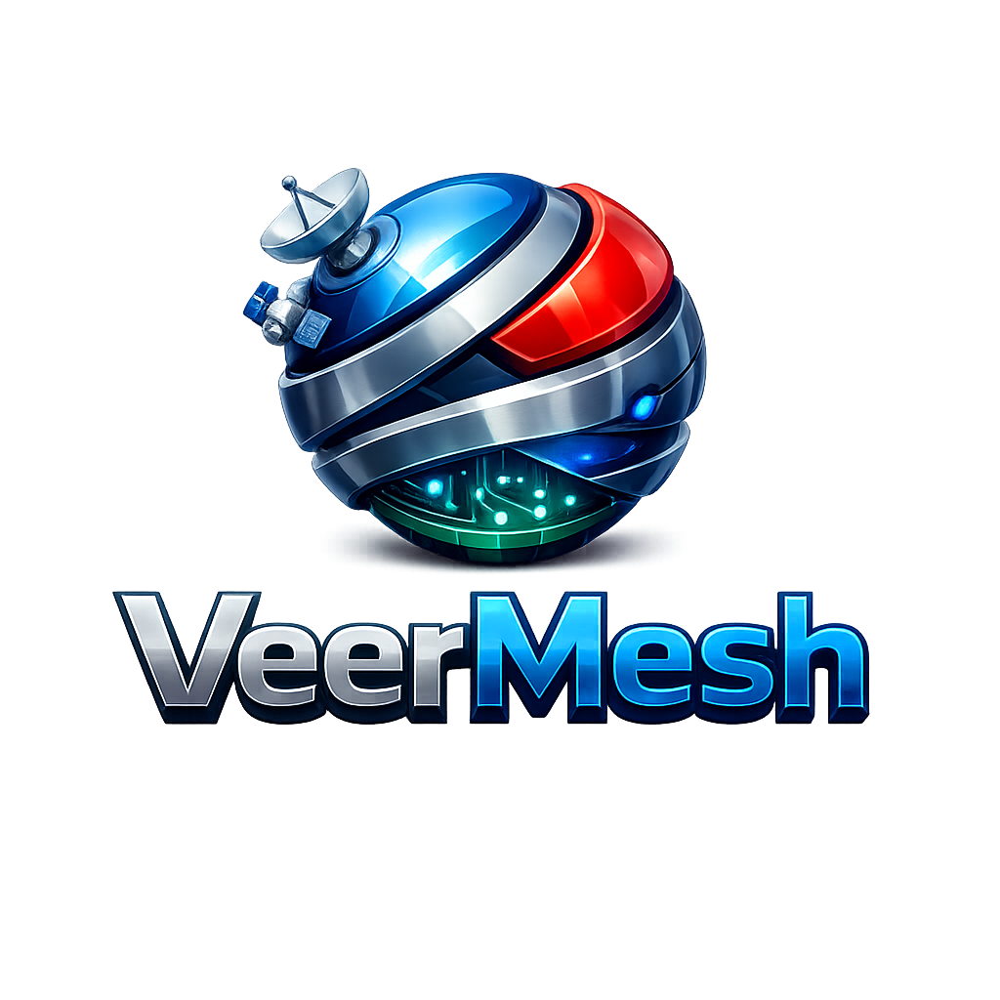

<p align="center">
  
</p>

<p align="center">
  <strong>AI-Native Distributed Edge Fabric for the 6G Era</strong>
</p>

<p align="center">
  Transforming heterogeneous edge devices into one intelligent, secure, self-organizing computing platform.
</p>

---

VeerMesh is an open, cloud-native edge fabric that transforms thousands of heterogeneous devices into a single intelligent, secure, and self-organizing computing platform.

Unlike traditional IoT platforms or container orchestrators, VeerMesh is designed around the convergence of **AI**, **distributed computing**, **industrial connectivity**, **edge intelligence**, and the emerging architectural principles of **6G**.

The platform runs on today's infrastructure—including Ethernet, Wi-Fi, private 5G, and cloud environments—while being architected to seamlessly evolve alongside future 6G networks.

---

## Vision

Create an open platform where compute, AI, data, sensing, and networking become shared resources across the edge.

VeerMesh enables applications to discover resources automatically, deploy intelligence where it is needed, adapt to changing network conditions, recover autonomously from failures, and scale from a single Raspberry Pi to globally distributed edge clusters.

---

## Core Principles

* **AI Native** — AI is a first-class platform capability, not an add-on.
* **Edge First** — Intelligence executes as close to data sources as possible.
* **Distributed by Design** — Every node contributes compute, storage, sensing, and networking capabilities.
* **Cloud Agnostic** — Deploy anywhere.
* **Industrial Ready** — Native support for operational technology (OT) and industrial protocols.
* **Secure by Default** — Zero Trust architecture with strong workload identity and encrypted communications.
* **Open & Extensible** — Modular architecture with well-defined APIs and plugin interfaces.

---

# Platform Architecture

```text
                    Applications
──────────────────────────────────────────────

Manufacturing
Robotics
Digital Twins
Healthcare
Smart Cities
Energy
Agriculture
Transportation
AI Agents

──────────────────────────────────────────────
               VeerMesh Fabric
──────────────────────────────────────────────

AI Fabric
Compute Fabric
Data Fabric
Service Fabric
Security Fabric
Sensing Fabric

──────────────────────────────────────────────
             VeerEdge Runtime
──────────────────────────────────────────────

Raspberry Pi
Jetson
Industrial PC
ARM SBC
x86 Server
Robot Controller
PLC Gateway

──────────────────────────────────────────────
Network Connectivity

Ethernet
Wi-Fi
Private 5G
LTE
Satellite
Future 6G

──────────────────────────────────────────────
Industrial Connectivity

OPC UA
MQTT
PROFINET
EtherCAT
Modbus
CAN
BLE
Matter
Zigbee
```

---

# Platform Fabrics

## AI Fabric

* AI model registry
* Distributed inference
* Federated learning
* AI agents
* Edge RAG
* AI scheduling
* Model lifecycle management

---

## Compute Fabric

* Distributed scheduling
* Resource discovery
* CPU/GPU/NPU orchestration
* Workload migration
* Edge clustering
* Elastic scaling

---

## Data Fabric

* Event streaming
* Digital Twin synchronization
* Vector storage
* Time-series storage
* Distributed caching
* Offline synchronization

---

## Service Fabric

* Service discovery
* gRPC
* QUIC
* HTTP/3
* API Gateway
* Event Bus

---

## Security Fabric

* Zero Trust
* Mutual TLS
* Workload identity
* Hardware-backed trust
* Secure boot verification
* Remote attestation
* Policy enforcement
* Post-quantum cryptography readiness

---

## Sensing Fabric

* Camera
* LiDAR
* Radar
* GPS
* IMU
* Environmental sensors
* Industrial telemetry
* Unified sensing APIs

---

# Technology Stack

| Layer         | Technology                               |
| ------------- | ---------------------------------------- |
| Language      | Rust (Edition 2024)                      |
| Async Runtime | Tokio                                    |
| RPC           | gRPC (tonic)                             |
| Transport     | QUIC / HTTP/3                            |
| Serialization | Protobuf                                 |
| Messaging     | NATS (initial), Kafka adapter            |
| Storage       | SQLite, PostgreSQL                       |
| AI Runtime    | ONNX Runtime, Candle, llama.cpp adapters |
| Containers    | OCI (Podman / CRI-O compatible)          |
| Web UI        | React + TypeScript                       |
| Observability | OpenTelemetry                            |

---

# Initial Roadmap

## Phase 1 — Foundation

* [ ] Node Runtime
* [ ] Cluster Formation
* [ ] Service Discovery
* [ ] Secure Messaging
* [ ] Compute Scheduler
* [ ] Web Dashboard

---

## Phase 2 — AI Fabric

* [ ] Model Registry
* [ ] Distributed Inference
* [ ] AI Agent Runtime
* [ ] GPU Scheduling
* [ ] Federated Learning

---

## Phase 3 — Industrial Edge

* [ ] OPC UA
* [ ] MQTT
* [ ] Modbus
* [ ] PROFINET
* [ ] EtherCAT
* [ ] CAN Bus

---

## Phase 4 — Autonomous Edge

* [ ] Digital Twins
* [ ] Intent-Based Deployment
* [ ] Self-Healing
* [ ] AI Resource Optimizer
* [ ] Autonomous Scheduling

---

## Phase 5 — 6G Ready

* [ ] Integrated Sensing
* [ ] Space-Air-Ground Connectivity
* [ ] Edge AI Federation
* [ ] Distributed Digital Twins
* [ ] AI-Native Network Orchestration

---

# Project Status

**Current Stage:** Architecture & Foundation

VeerMesh is in the initial design phase. The goal of Version 1.0 is to establish the core runtime, clustering capabilities, and foundational fabrics that will support future AI-native edge applications.

---

# Contributing

Community contributions are welcome.

Areas of interest include:

* Rust Systems Programming
* Distributed Systems
* AI Infrastructure
* Edge Computing
* IIoT
* Industrial Automation
* Networking
* Security
* Digital Twins
* Observability

---

# License

Apache License 2.0

---

## Vision Statement

> **Build the open AI-native edge fabric that powers the next generation of intelligent systems—from industrial automation and robotics to autonomous infrastructure and future 6G networks.**
